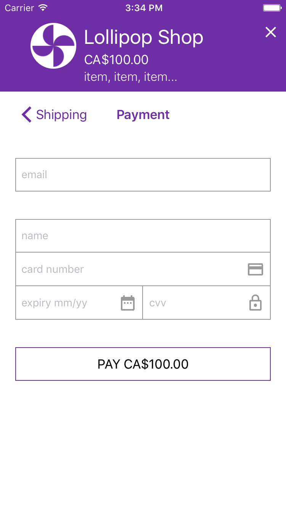

# Checkout for iOS



##### Table of Contents

* [Overview](#overview)
* [Platform Support](#platform-support)
* [Checkout](#checkout)
* [How It Works](#functionality)
* [Demo App](#demo)
* [CocoaPads Test App](#tester)
* [Integration Guide](#integration-guide)
* [Building Locally and Contributing](#contributing)

<a name="overview"/>

## Overview

Checkout is a client-side iOS framework that handles customer credit card input within a merchant's mobile app. This iOS framework limits the scope of a merchant's PCI compliance by removing the need for them to pass the sensitive information (credit card number, CVD, or expiry) through their servers and from having to write and store code that comes in contact with that sensitive information.

By integrating Checkout a developer can easily provide a way for users to accept payments in an iOS app. Checkout provides some client-side validation, smart field data formatting and a design that works in all iOS device form factors.

<a name="platform-support"/>

## iOS Support
 * iOS 9.0+
 * iPhone
 * iPad

<a name="checkout"/>

# Checkout

Checkout is a small iOS (Swift) framework project that you can add to your app project. Most apps will let users launch Checkout to gather credit card details from something like a button action.

<a name="functionality"/>

## How It Works

The Checkout controller is instantiated and presented by your app code. The resulting payment form may contain input fields for a shipping address, for a billing address and for credit card details.

Once the user has completed all fields with valid input, a processing closure provided by you is executed and is passed address information and a token for the credit card details. The processing closure is intended to allow the app developer to define a block of code to do any additional background processing and then dismiss the form.

<a name="demo"/>

## Demo App

While you can use Checkout via CocoaPods (see below in the integration guide) as an iOS developer you can also just clone this repo and build the Checkout Demo target yourself and try out the functionality. This project has no 3rd party dependencies and so we hope it's easy to build, and easy to try out, for yourself.

<a name="tester"/>

## CocoaPods Tester App

Use this [test app](https://github.com/Bambora/na-ios-checkout/PodsTester/) to see a working example of integrating Checkout using CocoaPods.

<a name="integration-guide"/>

## Integration Guide

Adding Checkout to your app could not be easier. You simply use CocoaPods and our Artifactory repository to add the Checkout framework. Checkout is configured by setting properties on the CheckoutViewController instance you create and present. It can be configured to collect shipping and billing addresses in addition to the card details.

The required parameters are:
* amount: the amount you are going to charge the customer
* currency: the currency

The optional parameters are:
* name: your company name
* image: your company logo
* primaryColor: the theme color to use - default is #8247B5
* purchaseDescription: a description of the purchase
* shippingAddressRequired: if the shipping address is required - true/false
* billingAddressRequired: if the billing address is required - true/false
* processingClosure: the block of code to be executed after a token is received

### Step 1: Setup Dev Tools

This project was compiled with Xcode 8.3 and uses Swift 3.

The first step is to install CocoaPods on your development machine. Then you will also need to install an Artifactory plugin for CocoaPods. You will then add the needed Cocoapods repository and add the Checkout pod to your app project. You can also supply several parameters to configure the form, such as your company name, logo, product description, price, currency, and whether billing/shipping addresses should be displayed.

***Example:***

* Go to https://cocoapods.org on how to setup CocoaPods. This framework was validated with CocoaPods v1.0.1.
* Setup the Artifactory plugin

```bash
> gem install cocoapods-art
```

* Add our CocoaPods repo

```bash
> pod repo-art add bambora-na-public "https://bambora.jfrog.io/bambora/api/pods/na-public"
```

* After having executed a 'pod init' in your iOS project directory, add the Artifactory plugin and Checkout pod to your Podfile as follows and then execute the standard 'pod install' command.

```bash
use_frameworks!

plugin 'cocoapods-art', :sources => [
  'bambora-na-public'
]

target 'MyProject' do
  pod 'Checkout'
end
```

* Note that 'pod update' alone does not update Artifactory based pod indexes as expected. Use 'pod repo-art update bambora-na-public' first and then use 'pod update'.

### Step 2: Add Checkout To Your App

Here is an example, written in Swift of how Checkout is wired to a button action that simply updated a status label.

```swift
@IBAction func buttonAction(sender: AnyObject) {
    let bundle = NSBundle.init(forClass: CheckoutViewController.classForCoder())
    let storyboard = UIStoryboard(name: "Checkout", bundle: bundle)
    if let controller = storyboard.instantiateInitialViewController() as? CheckoutViewController {
        self.statusLabel.text = ""

        controller.name = "Lollipop Shop"
        controller.amount = NSDecimalNumber(value: 100.00 as Double)
        controller.currencyCode = "CAD"
        controller.purchaseDescription = "item, item, item..."
        //controller.image = UIImage(named: "icon")
        //controller.primaryColor = UIColor.blue              // default: "#8247B5"
        //controller.shippingAddressRequired = true           // default: true
        //controller.billingAddressRequired = true            // default: true
        //controller.tokenRequestTimeoutSeconds = 6           // default: 6

        controller.processingClosure = { (result: Dictionary<String, AnyObject>?, error: NSError?) -> Void in
            if let error = error {
                let msg  = "error (\(error.code)): \(error.localizedDescription)"
                self.statusLabel.text = msg
            }
            else if let result = result {
                if let cardInfo = result["cardInfo"] as? Dictionary<String, String>, let token = cardInfo["code"] as String! {
                    self.statusLabel.text = "token: \(token)"
                }
                else {
                    self.statusLabel.text = "No Token!"
                }

                if let shippingInfo = result["shippingAddress"] as? Dictionary<String, String> {
                    print("shipping: \(shippingInfo)")
                }

                if let billingInfo = result["billingAddress"] as? Dictionary<String, String> {
                    print("billing: \(billingInfo)")
                }
            }
            else {
                let msg = "No error and no result data!"
                self.statusLabel.text = msg
            }

            self.dismiss(animated: true, completion: nil)
            self.view.setNeedsLayout() // Needed in case of view orientation change
        }

        self.present(controller, animated: true, completion: nil)
    }
}
```

### Step 3: Process The Payment

Whether you collect the tokenized card data and send it asynchronously to your server, or take any other action, you will need to collect the cardInfo code string value that is your token to process the payment with.

Now that you have tokenized card data on your server use it to [Call our APIs](https://developer.na.bambora.com/docs/guides/merchant_quickstart/calling_APIs/) to either process a payment, pre-authorize a payment or create a payment profile.

---

<a name="contributing"/>

## Building Locally and Contributing

 * Check out repo: `$ git clone git@github.com:Bambora/na-ios-checkout.git`
 * Open CheckoutTest.xcworkspace in Xcode
 * Fork the repo to commit changes to and issue Pull Requests as needed.

---

# API References

* [Merchant Quickstart](https://developer.na.bambora.com/docs/guides/merchant_quickstart/)
* [Merchant API](https://developer.na.bambora.com/docs/references/merchant_API/)
